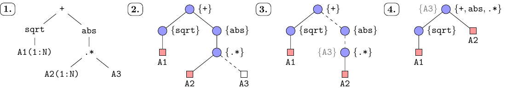
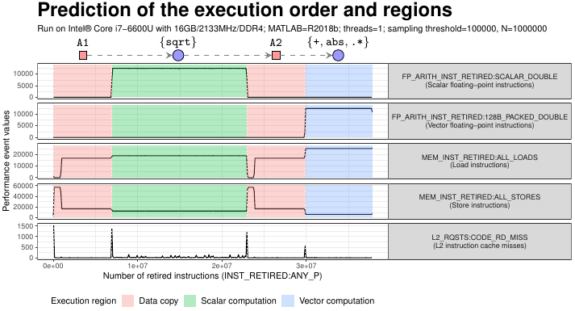
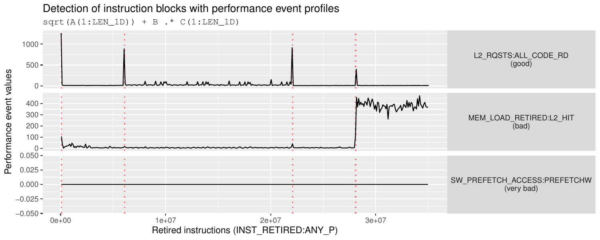

# lcpc19-execution-model

Supplementary materials to the article presented at [32nd Workshop on Languages and Compilers for Parallel Computing LCPC 2019](https://lcpc19.cc.gatech.edu/):

[_"Using Performance Event Profiles to Deduce an Execution Model of MATLAB with Just-In-Time Compilation"_ by Patryk Kiepas, Corinne Ancourt, Claude Tadonki, and Jarosław Koźlak](paper/Kiepas_et_al_Using_Performance_Profiles_LCPC19.pdf).

Contact: _kiepas.patryk at gmail.com_

## Execution model

Using the model presented in the paper, we will make several predictions about the execution of MATLAB R2018b codes.
The prediction is automatic and uses our Java 1.8 implementation of the model located inside [execution_model](execution_model/) directory.
You can build the project yourself (using Maven) or use the prebuilt binary [execution_model-1.0.jar](execution_model/lib/execution_model-1.0.jar).
Then, run the model using one of two ways:

* `./predict_expr_cli.sh "A+B+cos(C(1:N)).*A(1:N)"` — predict the execution of a given MATLAB expression
* `./predict_examples.sh` — run prediction of examples from _Example predictions_ section below

### Visualisation of the execution model

  

The model in four steps:
1. Represent MATLAB expression as the abstract-syntax tree (AST)
2. Create an initial instruction tree (`blue circle` — instruction block, `red square` — array copy, `white square` — array reference)
3. Mark instruction blocks for merging
4. Merge the blocks! The resulting tree is our execution prediction:

  

### Supported built-in functions

The model predicts execution for codes which use following arithmetic operations and built-in functions:

> abs, acos, acosh, asin, asinh, atan, atan2, atanh, ceil, colon, cos, cosh, ctranspose, cumprod, cumsum, det, diff, eig, exp, expm1, fft, fix, fliplr, floor, gamma, ifft, imag, ldivide, log, log10, log1p, log2, max, mean, min, minus, mod, mtimes, nextpow2, norm, ones, plus, pow2, power, prod, rand, randn, rdivide, real, rem, round, sign, sin, sinh, sqrt, sum, tan, tanh, times, transpose, uminus, uplus, zeros

### Example predictions

The table below presents the predicted execution of several MATLAB codes.
First, look at the legend for the _execution prediction_ column in the table:

* `[]` — an instruction block (has at least one instruction)
* `[]{A, B, C}` — references to arrays used in the instruction block
* `!A`, `!B`, `!C` — explicit copy of arrays (array slicing)
* `✔` — combinable instruction (which can coexist with other instructions in the same block)
* `✘` — non-combinable/single instruction (such instruction requires the whole block for itself)

| id               | MATLAB code                                       | Execution prediction                                                                  |
| ---------------- | ------------------------------------------------- | ------------------------------------------------------------------------------------- |
| _mit_1_          | `sum(round(A))`                                   | `[round ✔]{A} ⟹ [sum ✘]`                                                              |
| _mit_2_          | `floor(A) + sqrt(fix(B .* C))`                    | `[floor ✔]{A} ⟹ [fix ✔, times ✔]{B, C} ⟹ [sqrt ✘] ⟹ [plus ✔]`                         |
| _mit_2_reversed_ | `sqrt(fix(B .* C)) + floor(A)`                    | `[fix ✔, times ✔]{B, C} ⟹ [sqrt ✘] ⟹ [plus ✔, floor ✔]{A}`                            |
| _mit_3_          | `floor(A) + sin(fix(B .* C))`                     | `[plus ✔, sin ✔, fix ✔, times ✔, floor ✔]{A, B, C}`                                   |
| _mit_3_reversed_ | `sin(fix(B .* C)) + floor(A)`                     | `[plus ✔, floor ✔, sin ✔, fix ✔, times ✔]{A, B, C}`                                   |
| _mit_4_          | `exp((A.^D + B.^E) ./ (C.^F))`                    | `[power ✘]{A, D} ⟹ [power ✘]{B, E} ⟹ [plus ✔] ⟹ [power ✘]{C, F} ⟹ [exp ✔, rdivide ✔]` |
| _mit_5_          | `A(1:LEN_1D) .* atan2(B(1:LEN_1D), C)`            | `!A ⟹ !B ⟹ [times ✔, atan2 ✔]{C}`                                                     |
| _mit_5_reversed_ | `atan2(B(1:LEN_1D), C) .* A(1:LEN_1D)`            | `!B ⟹ [atan2 ✔]{C} ⟹ !A ⟹ [times ✔]`                                                  |
| _mit_6_          | `log(A) + B + C(1:LEN_1D)`                        | `[log ✘]{A} ⟹ [plus ✔]{B} ⟹ !C ⟹ [plus ✔]`                                            |
| _mit_6_reversed_ | `log(A) + C(1:LEN_1D) + B`                        | `[log ✘]{A} ⟹ !C ⟹ [plus ✔ x 2]{B}`                                                   |
| _mit_7_          | `fix(A(1:LEN_1D)) + (B(1:LEN_1D) .* C(1:LEN_1D))` | `!A ⟹ [fix ✔] ⟹ !B ⟹ !C ⟹ [plus ✔, times ✔]`                                          |
| _mit_7_reversed_ | `(B(1:LEN_1D) .* C(1:LEN_1D)) + fix(A(1:LEN_1D))` | `!B ⟹ !C ⟹ [times ✔] ⟹ !A ⟹ [plus ✔, fix ✔]`                                          |
| _mit_8_          | `A(1:LEN_1D) + (B(1:LEN_1D) + C(1:LEN_1D))`       | `!A ⟹ !B ⟹ !C ⟹ [plus ✔ x 2]`                                                         |
| _mit_8_reversed_ | `(B(1:LEN_1D) + C(1:LEN_1D)) + A(1:LEN_1D)`       | `!B ⟹ !C ⟹ [plus ✔] ⟹ !A ⟹ [plus ✔]`                                                  |

By reversing some of the above expressions, we affect how they are compiled by the Just-In-Time (JIT) compiler, thus, changing their execution.
The model allows us to make a conscious decision about which part of the expression, and how, to transform to increase code performance.

## Detection of instruction blocks

Just-In-Time (JIT) compiler in MATLAB (and in other environments too) generates machine code of an input code in chunks.
We call these chunks instruction blocks as they contain instructions ready to be transformed from a high-level MATLAB code into the low-level machine code.
The remaining question is when an input code is divided into chunks (instruction blocks)?

  

To answer this question, we have built every possible performance event profiles (PEP) of the expression `sqrt(A(1:LEN_1D)) + B .* C(1:LEN_1D)`.
Values in profiles are sampled every `100000` retired instructions (`INST_RETIRED:ANY_P`).
The above plot shows three performance event profiles for this expression.
One of them is a good candidate for the detection (`L2_RQSTS:ALL_CODE_RD`) because it marks only the transition points between two instruction blocks. Hence, it allows for easy detection.
Other two performance events (`MEM_LOAD_RETIRED:L2_HIT`, `SW_PREFETCH_ACCESS:PREFETCHW`), either show no change between blocks or they show a change in the value level, which usually indicates blocks perform vastly different computations.

Plot [performance_event_profiles.pdf](detection_instruction_blocks/plots/performance_event_profiles.pdf) presents results of all performance events where some of them indicates a clear division between two instruction blocks marked as spikes aligned with the red dashed line.
To re-generate the plot execute [plot_result.R](detection_instruction_blocks/plot_result.R) script.

Read more about the results [here](detection_instruction_blocks/).
